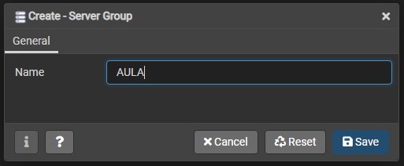

# ⌨️ Comandos usados


## Módulo: Objetos e tipos de dados do PostgreSQL

### Aula: Conheça a ferramenta PGAdmin

- Acessar pgAdmin4 via browser
   - Normalmente é aberto automaticamente, quando pgAdmin4 é iniciado
- Na barra de ferramentas, clicar em `Object`
- Selecionar a opção `Create` e após `Server Group...`


- Definir nome do `Server Group`




- Na barra de ferramentas, novamente acessar a opção `Object`
- Clicar em `Create Server`


- Definir nome do servidor, o grupo de servidor e comentários (opcional)


- Configurar URL e porta do servidor e definir usuário e senha


- Para abrir Query Tool, selecione o database `postgres`, dentro do servidor `aula`
- Na barra de ferramentas, acesse a opção `Tools`, em seguida `Query Tool`


- No `Query Editor` aberto, digitar o comando:

```sql
    CREATE DATABASE financas;

```

- Executar o comando pressionando `F5` (atalho de teclado)


### Aula: Objetos e comandos do banco de dados

- Criar as tabelas `banco`, `agencia`, `cliente`, `conta_corrente`, `tipo_transacao` e `cliente_transacoes`

```sql
CREATE TABLE IF NOT EXISTS banco (
	numero INTEGER NOT NULL,
	nome VARCHAR(50) NOT NULL,
	ativo BOOLEAN NOT NULL DEFAULT TRUE,
	data_criacao TIMESTAMP NOT NULL DEFAULT CURRENT_TIMESTAMP,
	PRIMARY KEY (numero)
);

CREATE TABLE IF NOT EXISTS agencia (
	banco_numero INTEGER NOT NULL,
	numero INTEGER NOT NULL,
	nome VARCHAR(80) NOT NULL,
	ativo BOOLEAN NOT NULL DEFAULT TRUE,
	data_criacao TIMESTAMP NOT NULL DEFAULT CURRENT_TIMESTAMP,
	PRIMARY KEY (banco_numero, numero),
	FOREIGN KEY (banco_numero) REFERENCES banco (numero)
);

CREATE TABLE IF NOT EXISTS cliente (
	numero BIGSERIAL PRIMARY KEY,
	nome VARCHAR(120) NOT NULL,
	email VARCHAR(250) NOT NULL,
	ativo BOOLEAN NOT NULL DEFAULT TRUE,
	data_criacao TIMESTAMP NOT NULL DEFAULT CURRENT_TIMESTAMP
);

CREATE TABLE IF NOT EXISTS conta_corrente (
	banco_numero INTEGER NOT NULL,
	agencia_numero INTEGER NOT NULL,
	numero BIGINT NOT NULL,
	digito SMALLINT NOT NULL,
	cliente_numero BIGINT NOT NULL,
	ativo BOOLEAN NOT NULL DEFAULT TRUE,
	data_criacao TIMESTAMP NOT NULL DEFAULT CURRENT_TIMESTAMP,
	PRIMARY KEY (banco_numero, agencia_numero, numero, digito, cliente_numero),
	FOREIGN KEY (banco_numero, agencia_numero) REFERENCES agencia (banco_numero, numero),
	FOREIGN KEY (cliente_numero) REFERENCES cliente (numero)
);

CREATE TABLE IF NOT EXISTS tipo_transacao (
	id SMALLSERIAL PRIMARY KEY,
	nome VARCHAR(50) NOT NULL,
	ativo BOOLEAN NOT NULL DEFAULT TRUE,
	data_criacao TIMESTAMP NOT NULL DEFAULT CURRENT_TIMESTAMP
);

CREATE TABLE IF NOT EXISTS cliente_transacoes (
	id BIGSERIAL PRIMARY KEY,
	banco_numero INTEGER NOT NULL,
	agencia_numero INTEGER NOT NULL,
	conta_corrente_numero BIGINT NOT NULL,
	conta_corrente_digito SMALLINT NOT NULL,
	cliente_numero BIGINT NOT NULL,
	tipo_transacao_id SMALLINT NOT NULL,
	valor NUMERIC(15, 2) NOT NULL,
	data_criacao TIMESTAMP NOT NULL DEFAULT CURRENT_TIMESTAMP,
	FOREIGN KEY (banco_numero, agencia_numero, conta_corrente_numero, conta_corrente_digito, cliente_numero) REFERENCES conta_corrente (banco_numero, agencia_numero, numero, digito, cliente_numero)
);
```
